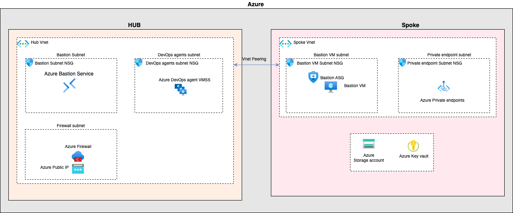

# iac-azure-wso2-products
Installation scripts for provisioning infrastructure on azure cloud to install WSO2 products

## Architecture
This repository contains the Terraform modules to set up [Hub-Spoke network topology](https://learn.microsoft.com/en-us/azure/architecture/networking/architecture/hub-spoke?tabs=cli).



### Modules

* [Hub](./modules/Hub)
* [Spoke](./modules/Spoke)

### Requirements

| Name | Version |
|------|---------|
| <a name="requirement_terraform"></a> [terraform](#requirement\_terraform) | = 0.14.10 |

### Providers

| Name | Version  |
|------|----------|
| <a name="requirement_azuread"></a> [azuread](#requirement\_azuread) | = 2.14.0 |
| <a name="requirement_azurerm"></a> [azurerm](#requirement\_azurerm) | = 3.52.0 |

### Required permission

* [Owner role](https://learn.microsoft.com/en-us/azure/role-based-access-control/built-in-roles/general#owner) at an Azure subscription scope
* [Cloud Application Administrator](https://learn.microsoft.com/en-us/entra/identity/role-based-access-control/permissions-reference#cloud-application-administrator)
* [Groups Administrator](https://learn.microsoft.com/en-us/entra/identity/role-based-access-control/permissions-reference#groups-administrator)

### Usage

1. Configure Terraform block 

```terraform
terraform {
  required_version = "= 0.14.10"

  required_providers {
    azurerm = {
      source  = "hashicorp/azurerm"
      version = "= 3.52.0"
    }
    azuread = "= 2.14.0"
  }
}
```

2. Refer the Hub and Spoke modules
```terraform
module "hub" {
  source = "git::https://github.com/wso2/iac-azure-wso2-products.git//modules/Hub?ref=main"
  
}

module "spoke" {
  source = "git::https://github.com/wso2/iac-azure-wso2-products.git//modules/Spoke?ref=main"

}
```

### More details on module inputs and outputs, please refer to followings,

* [Hub](./modules/Hub/README.md)
* [Spoke](./modules/Spoke/README.md)
